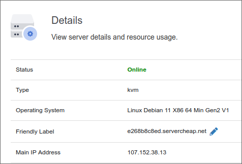
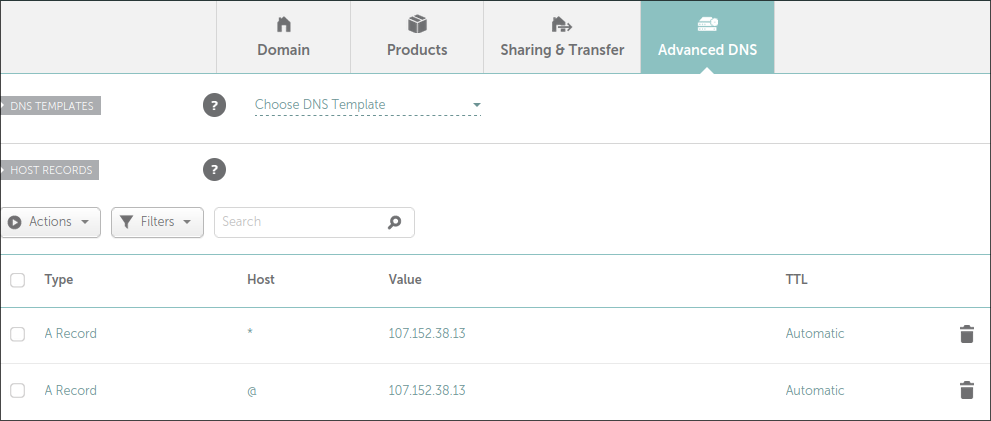
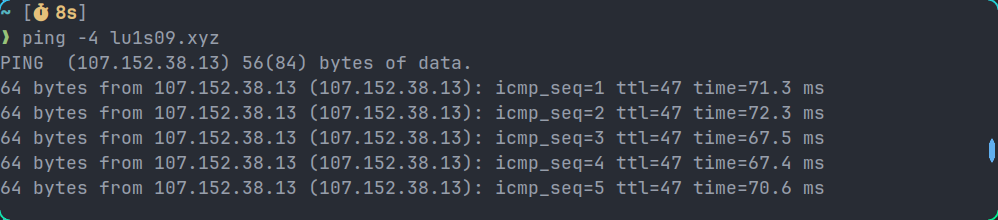

+++
title = "Conectar servidor con dominio"
date = 2023-05-05
draft = false 
[taxonomies]
tags = ["servidor", "vps", "dominio"]
+++

Ya que tienes un dominio y un servidor, puedes conectarlos mediante
registros DNS. Esto permitirá que la gente ingrese `www.misitio.xyz` o 
`blog.misitio.xyz` en lugar de direcciones IP como `142.251.34.238`.

## Obtener dirección IPv4 de tu servidor

Independientemente del proveedor de VPS que hayas elegido, puedes consultar
la dirección IPv4 en los detalles de tu servidor. Algo parecido a lo 
siguiente:

Este valor es necesario para hacer el enlace con el dominio.

## Ingresa a tu registrador de Dominios

En el caso de Namecheap, selecciona tu dominio de la 
[lista de dominios](https://ap.www.namecheap.com/domains/list/), después
ve al apartado *Advanced DNS*.

Deberás agregar dos registros de la siguiente manera, cambiando el valor por
la dirección IPv4 correspondiente de tu servidor.

Estos registros permitirán que el dominio que hayas elegido y cualquier 
subdominio apunten al servidor indicado.

## Ponerlo a prueba

Puedes comprobar que el nombre de dominio apunta a tu servidor mediante
un `ping`. Aunque es probable que tome unos minutos en tomar efecto.

Ahora puedes [configurar un servidor web](@/nginx-docker/index.md) para alojar 
tu primer página web.
