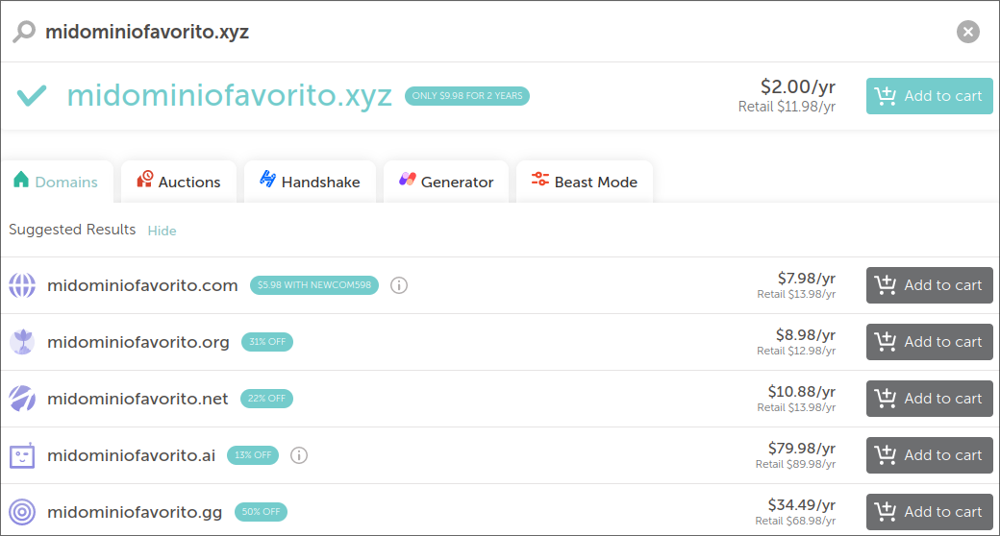

+++
title = "Obtener un nombre de dominio"
date = 2023-05-01
draft = false 
slug = "dominio"
[taxonomies]
tags = ["dominio"]
+++

Un nombre de dominio es el nombre que ingresas en la barra de dirección del
navegador web. El nombre de dominio de este sitio es `lu1s09.xyz`. 

El precio del dominio puede cambiar dependiendo el dominio de nivel superior
o extensión, por ejemplo, el primer año de este dominio costó aproximadamente 
2 dólares.

Existen distintos sitios donde registrar nombres de dominio, siendo 
[Namecheap](https://namecheap.com) el que yo utilizo. Basta con ingresar
un nombre para obtener una lista de los dominios disponibles.

El siguiente paso es [obtener un servidor](@/obtener-servidor/index.md) 
para alojar tu primer página web.
