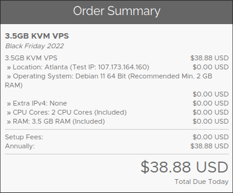

+++
title = "Obtener un Servidor"
date = 2023-05-03
draft = false 
slug = "servidor"
[taxonomies]
tags = ["servidor", "debian", "vps"]
+++

Un servidor virtual privado o VPS te permite publicar tus aplicaciones en
Internet de manera sencilla, ya que facilita la compra y configuración de 
hardware, conexión de Internet y electricidad.

Cada proveedor ofrece distintas características que debes considerar para 
tu caso específico, por ejemplo, la localización geográfica, la cantidad de 
RAM, CPU o almacenamiento, el catálogo de sistemas operativos, la velocidad 
de la red y el precio.

Los VPS más asequibles usualmente cuestan 5 dólares al mes, ofreciendo los
recursos necesarios para alojar múltiples sitios web, entre otros servicios.
En esta categoría entran proveedores como 
[Vultr](https://www.vultr.com/pricing/#cloud-compute/), 
[Linode](https://www.linode.com/products/shared/) o
[Ionos](https://www.ionos.mx/servidores/vps#planes).

Personalmente decidí experimentar con [Racknerd](https://www.racknerd.com/),
que tiene ofertas interesantes si pagas por un año.

El siguiente paso será [conectar el servidor con el nombre de dominio](@/dns/index.md)
mediante registros DNS.

